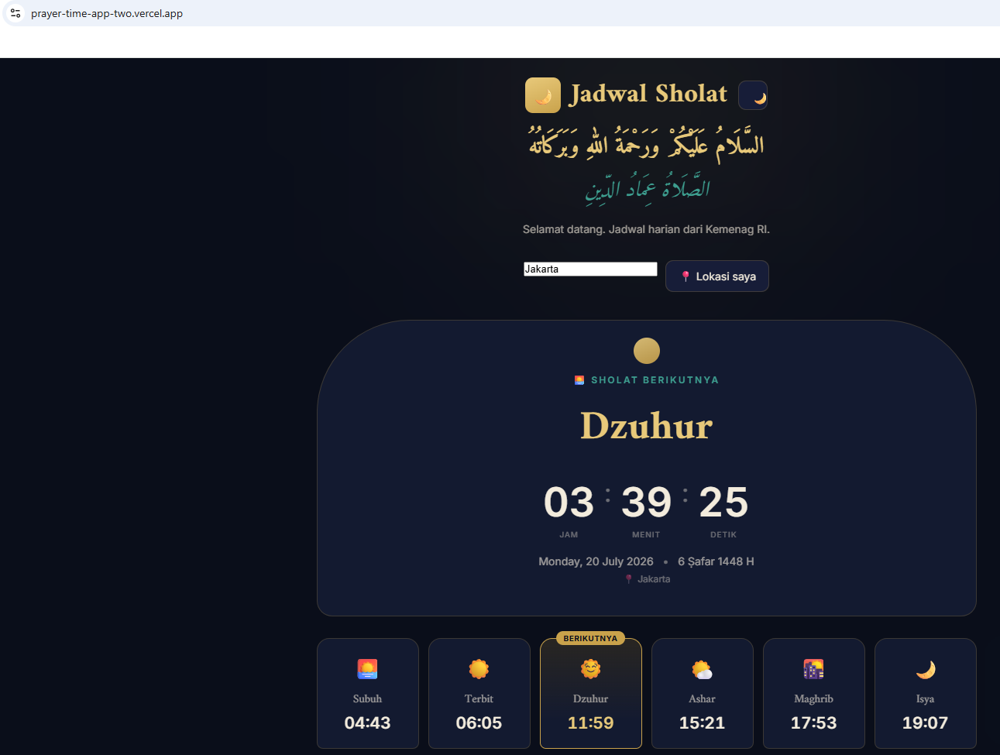

# 🚀 DevOps Homelab Journey

Catatan progress belajar DevOps di homelab pribadi (Windows + WSL2), sebagai persiapan karir di bidang DevOps.

**Environment:** Windows + WSL2 (Ubuntu 24.04) + Docker Desktop
**RAM:** 16GB
**Goal:** Karir di bidang DevOps / Junior DevOps Engineer

**🔴 Live Demo:** [Aplikasi Jadwal Sholat](https://prayer-time-app-two.vercel.app/) — studi kasus deployment dari [Day 10](./day-10-cicd-advanced/notes.md) & [Day 11](./day-11-deploy-vercel/notes.md)

---

## 📖 Daftar Isi

| Day | Topik | Status |
|---|---|---|
| [Day 01](./day-01-linux-docker-basics/notes.md) | Linux CLI Basics & Docker Fundamentals | ✅ Selesai |
| [Day 02](./day-02-networking-volumes/notes.md) | Docker Networking & Volumes | ✅ Selesai |
| [Day 03](./day-03-git-workflow/notes.md) | Git & GitHub Workflow (branching, PR) | ✅ Selesai |
| [Day 04](./day-04-github-actions/notes.md) | CI/CD Pipeline dengan GitHub Actions | ✅ Selesai |
| [Day 05](./day-05-kubernetes-basics/notes.md) | Kubernetes Dasar (kind) | ✅ Selesai |
| [Day 06](./day-06-terraform/notes.md) | Infrastructure as Code — Terraform | ✅ Selesai |
| [Day 07](./day-07-ansible/notes.md) | Configuration Management — Ansible | ✅ Selesai |
| [Day 08](./day-08-monitoring/notes.md) | Monitoring — Prometheus + Grafana | ✅ Selesai |
| [Day 09](./day-09-kubernetes-advanced/notes.md) | Kubernetes Lanjutan — Helm, Ingress, StatefulSet | ✅ Selesai |
| [Day 10](./day-10-cicd-advanced/notes.md) | CI/CD Lanjutan — Multi-stage Pipeline & Deploy ke K8s | ✅ Selesai |
| [Day 11](./day-11-deploy-vercel/notes.md) | Deploy Production — GitLab ke Vercel | ✅ Selesai |
| [Day 12](./day-12-security-basics/notes.md) | Security Dasar — Container Scanning & Vault | ✅ Selesai |

---

## 🗺️ Roadmap Besar

- [x] Fondasi Linux CLI
- [x] Docker fundamentals (image, container, Dockerfile, Compose)
- [x] Docker networking & volumes (persistent data)
- [x] Git & GitHub workflow (branching, PR)
- [x] CI/CD pipeline dengan GitHub Actions
- [x] Kubernetes dasar (kind / Minikube)
- [x] Infrastructure as Code — Terraform
- [x] Configuration management — Ansible
- [x] Monitoring — Prometheus + Grafana

---

## 🎉 Roadmap Awal Selesai!

Semua topik di roadmap awal sudah tuntas dipelajari — dari Linux CLI dasar sampai monitoring. Fondasi ini mencakup siklus DevOps dari ujung ke ujung: **Docker (containerization) → Git/CI-CD (delivery) → Kubernetes (orchestration) → Terraform (infrastructure) → Ansible (configuration) → Prometheus/Grafana (monitoring)**.

## 🚀 Kemungkinan Topik Lanjutan

- [ ] Terraform + cloud provider sungguhan (AWS/GCP free tier)
- [x] Kubernetes lebih lanjut (Helm, Ingress Controller, StatefulSet)
- [x] CI/CD lanjutan (multi-stage pipeline, deploy otomatis ke Kubernetes)
- [ ] Logging terpusat (ELK Stack / Loki)
- [x] Security dasar (container scanning, secret management dengan Vault)
- [ ] Sertifikasi (misal: CKA, Terraform Associate)

---

## 🛠️ Tech Stack yang Dipakai

- **OS:** Windows 11 + WSL2 (Ubuntu 24.04)
- **Containerization:** Docker Desktop
- **Version Control:** Git & GitHub
- **(akan menyusul):** Kubernetes, Terraform, Ansible, Prometheus, Grafana

---

## 📚 Referensi Umum

- [Docker Documentation](https://docs.docker.com/)
- [WSL2 + Docker Desktop Setup](https://docs.docker.com/go/wsl2/)

---

*Catatan pribadi — belajar DevOps dari nol, homelab di laptop Windows. Setiap folder `day-XX` berisi catatan detail, konsep, dan perintah yang dipelajari pada hari tersebut.*

