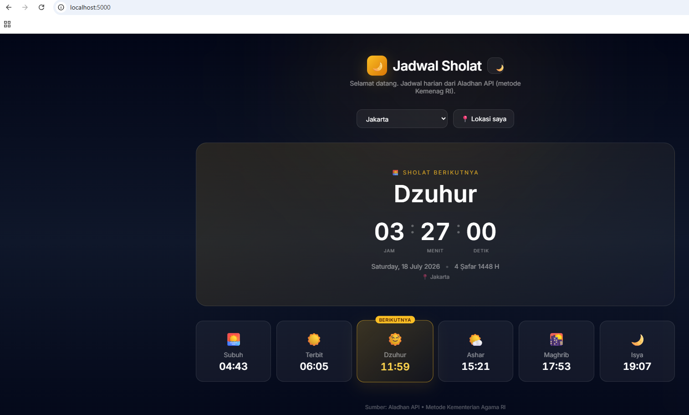

# Day 10 — CI/CD Lanjutan: Multi-Stage Pipeline & Deploy Otomatis ke Kubernetes

[⬅️ Kembali ke index](../README.md) | [⬅️ Day 09](../day-09-kubernetes-advanced/notes.md)

---

## ✅ Yang Dipelajari

- [x] Keterbatasan `runs-on: ubuntu-latest` untuk mengakses resource lokal (cluster `kind` di laptop)
- [x] Risiko keamanan self-hosted runner pada repo public (dan alasan menghindarinya)
- [x] Pendekatan alternatif: **ephemeral Kubernetes cluster** di dalam GitHub Actions runner
- [x] Membangun aplikasi nyata (Jadwal Sholat, Flask + Aladhan API) sebagai studi kasus pipeline
- [x] Menulis unit test dengan `pytest`
- [x] Dockerize aplikasi Python/Flask dengan healthcheck
- [x] Pipeline multi-stage: **Lint → Test → Build → Security Scan (Trivy) → Deploy ke cluster sementara**
- [x] Menyimpan Docker image sebagai artifact antar-job (`upload-artifact` / `download-artifact`)
- [x] Debugging kesalahan umum: commit tidak sengaja masuk ke `main`, typo atribut HTML, alias `python3`

---

## 🧠 Konsep Kunci

| Konsep | Penjelasan Singkat |
|---|---|
| **Self-hosted runner** | Menjalankan GitHub Actions di mesin sendiri (bukan server GitHub) — perlu untuk akses resource lokal, tapi **berisiko** di repo public karena fork/PR asing berpotensi menjalankan kode di mesin tersebut |
| **Ephemeral test cluster** | Cluster Kubernetes yang dibuat sementara **di dalam runner GitHub** (bukan di laptop), dipakai untuk verifikasi deployment, lalu otomatis dibuang begitu job selesai — aman untuk repo public |
| **Multi-stage pipeline** | Membagi proses CI/CD menjadi tahapan berurutan (`needs:`), setiap tahap baru berjalan jika tahap sebelumnya lolos |
| **Artifact antar-job** | Data (seperti Docker image `.tar`) yang dihasilkan satu job dan dipakai job lain, karena setiap job berjalan di runner terpisah yang tidak berbagi filesystem |
| **Trivy** | Tool open-source untuk memindai vulnerability pada image Docker |

---

## 🕌 Studi Kasus: Aplikasi Jadwal Sholat

Aplikasi Flask yang mengambil jadwal sholat harian dari **Aladhan API** (metode Kemenag RI), dengan tampilan dark theme, countdown real-time ke waktu sholat berikutnya, pilihan kota, dan deteksi lokasi otomatis.



### Struktur Proyek
```
day-10-cicd-advanced/app/
├── app.py
├── requirements.txt
├── test_app.py
├── Dockerfile
├── .dockerignore
├── templates/
│   └── index.html
└── static/
    ├── css/style.css
    └── js/app.js
```

### `requirements.txt`
```
Flask==3.0.3
requests==2.32.3
```

### `test_app.py`
```python
from app import app

def test_health():
    """Pastikan aplikasi bisa merespons"""
    client = app.test_client()
    response = client.get("/")
    assert response.status_code == 200

def test_api_timings_default():
    """Pastikan endpoint API jadwal sholat merespons dengan benar"""
    client = app.test_client()
    response = client.get("/api/timings?city=Jakarta")
    assert response.status_code == 200
    data = response.get_json()
    assert "timings" in data
    assert "Fajr" in data["timings"]

def test_static_files_served():
    """Pastikan file CSS dan JS bisa diakses"""
    client = app.test_client()
    css_response = client.get("/static/css/style.css")
    js_response = client.get("/static/js/app.js")
    assert css_response.status_code == 200
    assert js_response.status_code == 200
```

Jalankan lokal:
```bash
pip install -r requirements.txt --break-system-packages
pip install pytest --break-system-packages
python3 -m pytest test_app.py -v
```
Hasil: **3 passed**.

### `Dockerfile`
```dockerfile
FROM python:3.12-slim

WORKDIR /app

COPY requirements.txt .
RUN pip install --no-cache-dir -r requirements.txt

COPY app.py .
COPY templates/ templates/
COPY static/ static/

EXPOSE 5000

HEALTHCHECK --interval=30s --timeout=5s --start-period=5s \
  CMD python -c "import requests; requests.get('http://localhost:5000/')" || exit 1

CMD ["python", "app.py"]
```

### `.dockerignore`
```
__pycache__
*.pyc
.git
.gitignore
*.md
test_app.py
```

Build & test lokal:
```bash
docker build -t prayer-time-app .
docker run -d -p 5001:5000 --name prayer-test prayer-time-app
docker logs prayer-test
docker stop prayer-test && docker rm prayer-test
```

---

## 🚦 Keputusan Desain: Kenapa Tidak Pakai Self-Hosted Runner

Rencana awal adalah mendaftarkan laptop sebagai **self-hosted runner** agar workflow bisa langsung deploy ke cluster `kind` lokal. Namun GitHub menampilkan peringatan:

> "Using self-hosted runners in public repositories is not recommended. Forks of your public repository can potentially run dangerous code on your self-hosted runner by creating a pull request."

**Risikonya:** karena repo bersifat public, siapa pun bisa fork dan membuat Pull Request. Jika workflow tersebut ter-trigger dan berjalan di self-hosted runner, kode dari orang asing berpotensi mengakses laptop pribadi secara langsung — berbeda dari runner `ubuntu-latest` milik GitHub yang bersifat sekali-pakai dan terisolasi.

**Solusi yang dipilih:** pipeline sepenuhnya berjalan di runner `ubuntu-latest` milik GitHub, termasuk tahap "deploy" — dengan cara membuat **cluster Kubernetes sementara di dalam runner itu sendiri** (bukan di laptop), menggunakan `helm/kind-action`. Ini membuktikan deployment manifest valid dan aplikasi bisa berjalan, tanpa risiko keamanan apa pun terhadap mesin pribadi.

**Insight untuk portofolio:** pemisahan antara **CI** (build, test, scan — aman dijalankan di mana saja) dan **CD ke environment nyata** (butuh kredensial/akses khusus, biasanya lewat approval manual atau runner khusus yang terkontrol) adalah pola umum di dunia kerja nyata.

---

## 💻 Workflow Multi-Stage Lengkap

`.github/workflows/prayer-app-cicd.yml`:
```yaml
name: Prayer Time App CI/CD

on:
  push:
    branches:
      - main
      - day-10-cicd-advanced
    paths:
      - 'day-10-cicd-advanced/app/**'
  pull_request:
    branches:
      - main
    paths:
      - 'day-10-cicd-advanced/app/**'

defaults:
  run:
    working-directory: day-10-cicd-advanced/app

jobs:
  lint:
    name: Lint & Validate
    runs-on: ubuntu-latest
    steps:
      - uses: actions/checkout@v4
      - name: Set up Python
        uses: actions/setup-python@v5
        with:
          python-version: '3.12'
      - name: Install flake8
        run: pip install flake8
      - name: Lint Python code
        run: flake8 app.py --max-line-length=120 --ignore=E501,W503
      - name: Validate Dockerfile syntax
        run: docker build --check . || true

  test:
    name: Run Tests
    runs-on: ubuntu-latest
    needs: lint
    steps:
      - uses: actions/checkout@v4
      - name: Set up Python
        uses: actions/setup-python@v5
        with:
          python-version: '3.12'
      - name: Install dependencies
        run: |
          pip install -r requirements.txt
          pip install pytest
      - name: Run tests
        run: pytest test_app.py -v

  build:
    name: Build Docker Image
    runs-on: ubuntu-latest
    needs: test
    steps:
      - uses: actions/checkout@v4
      - name: Build Docker image
        run: docker build -t prayer-time-app:${{ github.sha }} .
      - name: Save image as artifact
        run: docker save prayer-time-app:${{ github.sha }} -o prayer-time-app.tar
      - name: Upload image artifact
        uses: actions/upload-artifact@v4
        with:
          name: docker-image
          path: day-10-cicd-advanced/app/prayer-time-app.tar
          retention-days: 1

  security-scan:
    name: Security Scan (Trivy)
    runs-on: ubuntu-latest
    needs: build
    steps:
      - uses: actions/checkout@v4
      - name: Download image artifact
        uses: actions/download-artifact@v4
        with:
          name: docker-image
          path: day-10-cicd-advanced/app
      - name: Load Docker image
        run: docker load -i prayer-time-app.tar
      - name: Run Trivy vulnerability scanner
        uses: aquasecurity/trivy-action@master
        with:
          image-ref: prayer-time-app:${{ github.sha }}
          format: 'table'
          severity: 'CRITICAL,HIGH'
          exit-code: '0'

  deploy-test:
    name: Deploy to Ephemeral Kind Cluster
    runs-on: ubuntu-latest
    needs: security-scan
    steps:
      - uses: actions/checkout@v4
      - name: Download image artifact
        uses: actions/download-artifact@v4
        with:
          name: docker-image
          path: day-10-cicd-advanced/app
      - name: Load Docker image
        run: docker load -i prayer-time-app.tar
      - name: Create kind cluster
        uses: helm/kind-action@v1
        with:
          cluster_name: ci-test-cluster
      - name: Load image into kind
        run: kind load docker-image prayer-time-app:${{ github.sha }} --name ci-test-cluster
      - name: Create deployment manifest
        run: |
          cat <<EOF > deployment.yaml
          apiVersion: apps/v1
          kind: Deployment
          metadata:
            name: prayer-app
          spec:
            replicas: 2
            selector:
              matchLabels:
                app: prayer-app
            template:
              metadata:
                labels:
                  app: prayer-app
              spec:
                containers:
                  - name: prayer-app
                    image: prayer-time-app:${{ github.sha }}
                    ports:
                      - containerPort: 5000
          ---
          apiVersion: v1
          kind: Service
          metadata:
            name: prayer-app
          spec:
            selector:
              app: prayer-app
            ports:
              - port: 80
                targetPort: 5000
          EOF
      - name: Deploy to cluster
        run: kubectl apply -f deployment.yaml
      - name: Wait for rollout
        run: kubectl rollout status deployment/prayer-app --timeout=120s
      - name: Verify pods running
        run: kubectl get pods -o wide
      - name: Test service via port-forward
        run: |
          kubectl port-forward service/prayer-app 8080:80 &
          sleep 5
          curl --fail http://localhost:8080/ || exit 1
          echo "Deployment verified successfully!"
```

### Alur Pipeline

```
lint  →  test  →  build  →  security-scan  →  deploy-test
```

Setiap job baru berjalan jika job sebelumnya (`needs:`) sukses — jika `lint` gagal, seluruh pipeline berhenti di situ, menghemat waktu dan resource dibanding menjalankan semua tahap sekaligus tanpa urutan.

**Hasil akhir:** seluruh 5 job berstatus sukses (hijau) di tab Actions GitHub.

---

## 🔧 Troubleshooting yang Dialami

| Masalah | Penyebab | Solusi |
|---|---|---|
| CSS tidak ter-load, tampilan polos tanpa styling | Typo pada atribut HTML: `href__=` (dua underscore) alih-alih `href=` pada tag `<link>` di `templates/index.html` | Perbaiki dengan `sed -i 's/href__=/href=/g' templates/index.html`, lalu hard refresh browser (`Ctrl+Shift+R`) |
| `Command 'python' not found` | WSL Ubuntu hanya menyediakan `python3`, tidak ada alias `python` secara default | Gunakan `python3` secara eksplisit, atau install `sudo apt install python-is-python3 -y` untuk alias permanen |
| Warning self-hosted runner di repo public | Repo bersifat public — fork/PR pihak luar berpotensi menjalankan kode berbahaya di runner yang terhubung ke mesin pribadi | Hindari self-hosted runner untuk repo public; gunakan ephemeral cluster di dalam runner `ubuntu-latest` sebagai gantinya |
| Workflow tidak muncul sama sekali di tab Actions setelah push | Commit tidak sengaja dilakukan di branch `main` secara langsung (bukan di branch fitur yang direncanakan), dan `main` lokal belum di-push (`ahead of origin/main by 1 commit`) | Jalankan `git status` untuk mengecek branch aktif dan status commit sebelum bingung mencari penyebab; push langsung dengan `git push origin main` |

---

## 📌 Insight Penting

- Pipeline multi-stage dengan `needs:` membuat proses lebih efisien — kegagalan di tahap awal (lint) menghentikan pipeline sebelum membuang waktu di tahap yang lebih berat (build, deploy)
- Keamanan bukan sekadar detail teknis tambahan — keputusan untuk **tidak** memakai self-hosted runner pada repo public adalah bagian penting dari cara berpikir DevOps yang matang, bukan sekadar kemudahan implementasi
- Ephemeral test cluster adalah pola yang sangat berguna: memverifikasi bahwa manifest Kubernetes benar-benar bisa di-deploy tanpa perlu resource produksi atau infrastruktur permanen
- Selalu cek `git status` dan `git branch` sebelum menyimpulkan ada yang error saat sesuatu "tidak muncul" seperti yang diharapkan — banyak kejadian yang terlihat seperti bug ternyata adalah langkah git yang terlewat

---

[⬅️ Kembali ke index](../README.md) | [⬅️ Day 09](../day-09-kubernetes-advanced/notes.md)
