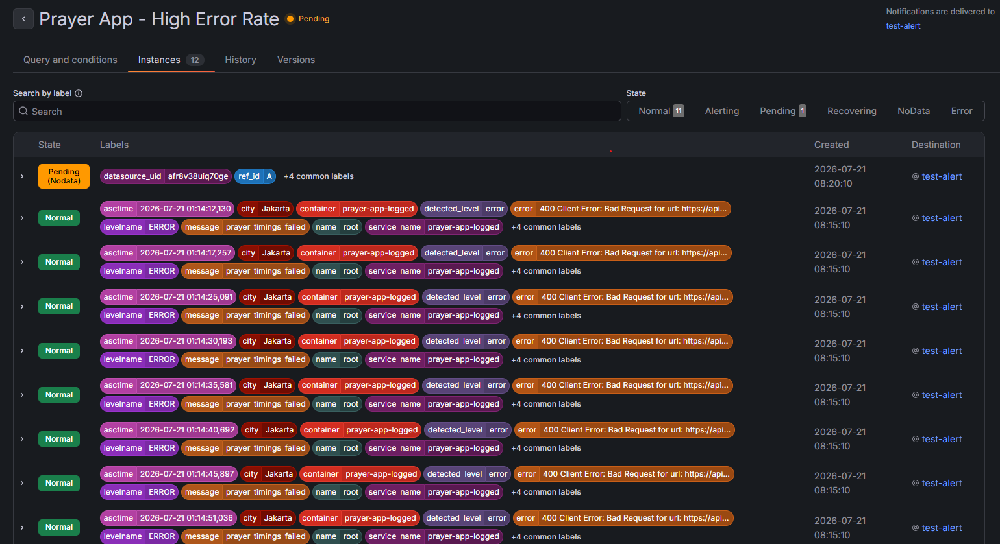
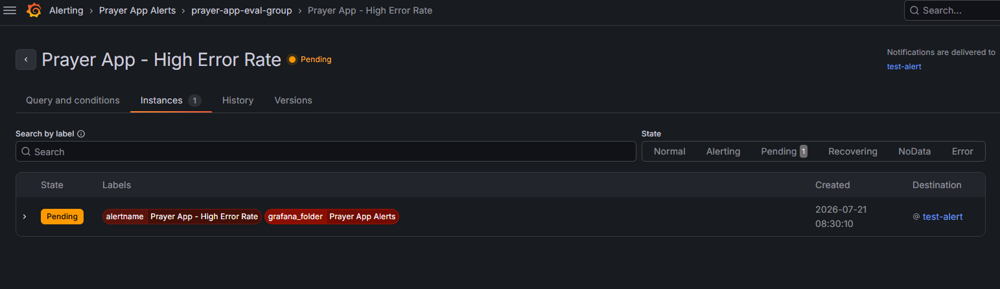
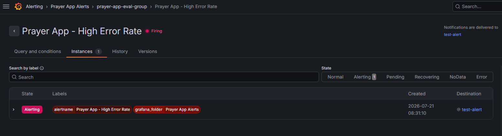
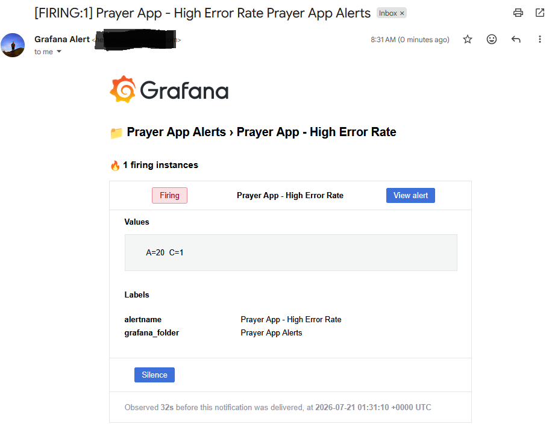
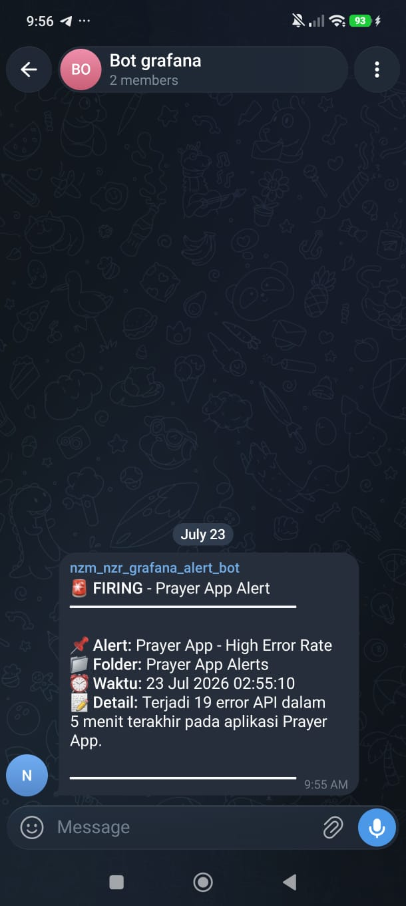
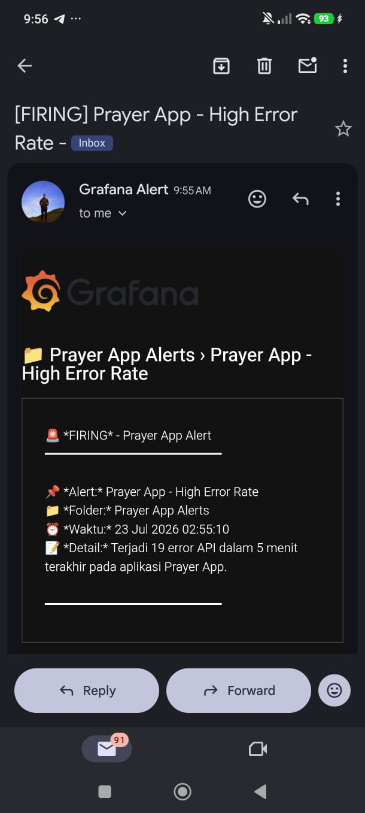

# Day 13 — Logging Terpusat: Structured Logging & Log-based Alerting dengan Loki

[⬅️ Kembali ke index](../README.md) | [⬅️ Day 12](../day-12-security-basics/notes.md)

---

## ✅ Yang Dipelajari

- [x] Evaluasi ulang opsi ELK Stack vs Loki setelah kendala Day 08 (limitasi Docker Desktop di WSL2)
- [x] Keputusan sadar untuk tidak memaksakan opsi berisiko (install Docker Engine kedua) demi stabilitas environment yang sudah berjalan
- [x] Structured logging (format JSON) pada aplikasi Flask menggunakan `python-json-logger`
- [x] Menjalankan aplikasi sebagai container agar otomatis terdeteksi Promtail
- [x] Query log terstruktur dengan LogQL (`| json`, filter per-field)
- [x] Agregasi log dengan `count_over_time()` dan `sum()`
- [x] Membuat Alert Rule berbasis log di Grafana (folder, evaluation group, pending period)
- [x] Debugging bug klasik LogQL: field bertipe *high-cardinality* yang menggandakan jumlah series
- [x] Membuktikan alur penuh alerting: `Normal → Pending → Firing → notifikasi email`

---

## 🧭 Keputusan: Tidak Melanjutkan ELK, Fokus Memperdalam Loki

Pada Day 08, ELK Stack (Elasticsearch, Kibana, Filebeat) terkendala limitasi arsitektur Docker Desktop di Windows/WSL2 — direktori `/var/lib/docker/containers` kosong karena Docker Desktop menjalankan daemon-nya di distro WSL tersembunyi yang terpisah.

Ada opsi untuk mengatasi ini dengan menginstal Docker Engine **native** langsung di WSL Ubuntu (bukan lewat Docker Desktop). Namun, opsi ini berisiko:
- Berpotensi konflik `docker.sock` dengan Docker Desktop yang sedang digunakan oleh seluruh lab sebelumnya (cluster `kind`, Vault, monitoring stack)
- Tidak ada jaminan solusi ini berjalan mulus di environment yang sudah kompleks

**Keputusan:** memilih jalur yang lebih aman — memperdalam Loki (yang sudah terbukti bekerja di Day 08) dengan fitur yang lebih substansial: structured logging dan log-based alerting. Ini tetap memenuhi tujuan "logging terpusat" tanpa mempertaruhkan stabilitas environment yang sudah berjalan baik.

**Insight:** keputusan DevOps yang matang bukan hanya soal "bisa dikerjakan", tapi juga mempertimbangkan risiko terhadap sistem yang sudah stabil — kadang jalur yang lebih aman dan sudah terbukti justru memberi nilai belajar yang lebih besar.

---

## 📋 Structured Logging pada Aplikasi Flask

### Instalasi

```bash
pip install python-json-logger --break-system-packages
echo "python-json-logger==2.0.7" >> requirements.txt
```

### Konfigurasi di `app.py`

```python
import logging
from pythonjsonlogger import jsonlogger

logHandler = logging.StreamHandler()
formatter = jsonlogger.JsonFormatter(
    "%(asctime)s %(levelname)s %(name)s %(message)s"
)
logHandler.setFormatter(formatter)
logger = logging.getLogger()
logger.addHandler(logHandler)
logger.setLevel(logging.INFO)
```

### Menambahkan Log di Endpoint

```python
@app.route("/api/timings")
def api_timings():
    city = request.args.get("city", "Jakarta")
    lat = request.args.get("lat")
    lng = request.args.get("lng")

    try:
        if lat and lng:
            url = f"{ALADHAN_BASE}/timings?latitude={lat}&longitude={lng}&method={METHOD}"
            logger.info("prayer_timings_request", extra={"mode": "geolocation", "lat": lat, "lng": lng})
        else:
            url = f"{ALADHAN_BASE}/timingsByCity"
            url += f"?city={requests.utils.quote(city)}&country=Indonesia&method={METHOD}"
            logger.info("prayer_timings_request", extra={"mode": "city_search", "city": city})

        res = requests.get(url, timeout=10)
        res.raise_for_status()
        json_data = res.json()
        if json_data.get("code") != 200:
            logger.warning("prayer_timings_invalid_response", extra={"city": city, "api_code": json_data.get("code")})
            return jsonify({"error": "Respons API tidak valid"}), 502
        logger.info("prayer_timings_success", extra={"city": city})
        return jsonify(normalize(json_data["data"]))
    except requests.RequestException as e:
        logger.error("prayer_timings_failed", extra={"city": city, "error": str(e)})
        return jsonify({"error": f"Gagal mengambil jadwal: {e}"}), 502
```

**Catatan:** variabel `json` (nama hasil `res.json()`) diganti menjadi `json_data` untuk menghindari potensi konflik dengan modul `json` bawaan Python — kebiasaan penamaan yang lebih aman.

### Contoh Output Log JSON

```json
{"asctime": "2026-07-20 07:51:26,953", "levelname": "INFO", "name": "root", "message": "prayer_timings_request", "mode": "city_search", "city": "Bandung"}
{"asctime": "2026-07-20 07:51:27,315", "levelname": "INFO", "name": "root", "message": "prayer_timings_success", "city": "Bandung"}
```

---

## 🐳 Menjalankan Aplikasi sebagai Container (agar Terdeteksi Promtail)

```bash
docker build -t prayer-time-app:logging-test .
docker network ls   # cari nama network monitoring stack, mis. monitoring-lab_default

docker run -d --name prayer-app-logged \
  --network monitoring-lab_default \
  -p 5002:5000 \
  prayer-time-app:logging-test
```

Karena Promtail memantau **semua** container Docker via `docker.sock`, container ini otomatis terdeteksi tanpa konfigurasi tambahan apa pun.

Generate log lewat `curl` (tidak bergantung pada UI frontend):
```bash
curl "http://localhost:5002/api/timings?city=Bandung"
curl "http://localhost:5002/api/timings?city=Surabaya"
```

---

## 🔍 Query Log Terstruktur dengan LogQL

```logql
# Semua log dari container
{container="prayer-app-logged"}

# Filter berdasarkan field JSON tertentu
{container="prayer-app-logged"} | json | message="prayer_timings_success"

# Filter berdasarkan kota
{container="prayer-app-logged"} | json | city="Bandung"
```

**Insight:** dengan structured logging, Loki bisa memfilter berdasarkan field spesifik (`message`, `city`, dll), bukan sekadar mencari potongan teks — jauh lebih presisi dibanding log baris teks polos yang dipakai di Day 08.

---

## 🔔 Log-based Alerting

### Query Agregasi (Percobaan Pertama — Bermasalah)

```logql
count_over_time({container="prayer-app-logged"} | json | message="prayer_timings_failed" [5m])
```

### 🐛 Bug: Ledakan Jumlah Instance Alert



**Gejala:** alert menghasilkan **12 instance terpisah** (satu per baris log), masing-masing dengan label `asctime` yang berbeda-beda — semuanya berstatus `Normal` meski total error sebenarnya sudah melebihi threshold.

**Penyebab:** `| json` tanpa menyebutkan field spesifik akan mempromosikan **seluruh** field JSON menjadi label — termasuk `asctime` yang nilainya selalu unik per baris (presisi milidetik). Akibatnya setiap baris log dianggap **series terpisah**, sehingga `count_over_time` menghitung masing-masing individual (masing-masing "1 kejadian" → selalu di bawah threshold) alih-alih menjumlahkan totalnya.

### ✅ Solusi: Bungkus dengan `sum()`

```logql
sum(count_over_time({container="prayer-app-logged"} | json | message="prayer_timings_failed" [5m]))
```

`sum()` menggabungkan seluruh series (meski label seperti `asctime` berbeda-beda) menjadi **satu angka tunggal** yang benar-benar merepresentasikan total error dalam jendela waktu tersebut.

---

## 📐 Konfigurasi Alert Rule

| Pengaturan | Nilai | Keterangan |
|---|---|---|
| Rule name | `Prayer App - High Error Rate` | |
| Query | `sum(count_over_time(... [5m]))` | Data source: Loki |
| Condition | `IS ABOVE 3` | Lebih dari 3 error dalam 5 menit |
| Folder | `Prayer App Alerts` | Baru dibuat untuk pengelompokan |
| Evaluation group | `prayer-app-eval-group`, interval `1m` | Seberapa sering kondisi dicek |
| Pending period | `1m` | Kondisi harus bertahan 1 menit sebelum status "Firing" |
| Keep firing for | `2m` | Alert tetap tampil "Firing" 2 menit setelah kondisi kembali normal |
| Contact point | Email (SMTP dari Day 08) | |

---

## 🔬 Eksperimen: Membuktikan Alur Alert Penuh

Generate error berkelanjutan (bukan sesaat), agar kondisi bertahan cukup lama untuk melewati *pending period*:

```bash
for i in $(seq 1 20); do
  curl -s "http://localhost:5002/api/timings?lat=invalid&lng=invalid" > /dev/null
  sleep 5
done
```

### Tahap 1 — Status Pending



### Tahap 2 — Status Firing



### Tahap 3 — Notifikasi Email Diterima



Email menunjukkan nilai `A=20 C=1` — 20 log error terkumpul dalam window, kondisi (`C`) terpenuhi (`1` = true), dan notifikasi terkirim **32 detik** setelah kondisi Firing tercapai (`Observed 32s before this notification was delivered`).

**Hasil:** alur lengkap dari kondisi ter-log → agregasi terdeteksi → status berubah `Normal → Pending → Firing` → notifikasi email terkirim, semuanya berhasil diverifikasi end-to-end.

---

## 🔧 Troubleshooting yang Dialami

| Masalah | Penyebab | Solusi |
|---|---|---|
| `localhost:5000` tidak bisa diakses, hanya IP WSL langsung yang bisa | Proses Flask sebelumnya berstatus `T` (Stopped, akibat `Ctrl+Z` bukan `Ctrl+C`), masih menahan port tanpa benar-benar berjalan | `kill -9 <PID>` proses yang macet, jalankan ulang; ke depannya selalu gunakan `Ctrl+C` untuk menghentikan server, bukan `Ctrl+Z` |
| Halaman aplikasi di `localhost:5002` tidak bisa memilih kota | Container berasal dari repo `journal` (Day 10) yang masih memakai struktur awal, belum memiliki fitur pencarian kota yang dibangun belakangan di repo terpisah (`prayer-time-app-vercel`) | Tidak masalah untuk kebutuhan generate log — endpoint API tetap bisa dipanggil langsung lewat `curl` tanpa bergantung pada UI |
| Query alert menghasilkan 12 instance terpisah, semuanya "Normal" meski total error tinggi | Field `asctime` (presisi milidetik, selalu unik) ikut menjadi label akibat `| json` tanpa filter field, menyebabkan setiap baris log dihitung sebagai series terpisah | Bungkus query dengan `sum()` agar seluruh series digabung menjadi satu angka total |
| Sempat mengira notifikasi email "telat" | Alert belum pernah benar-benar mencapai kondisi "Firing" yang valid akibat bug di atas — status berputar Pending↔Normal tanpa pernah stabil | Setelah query diperbaiki dengan `sum()`, alur Normal→Pending→Firing→email berjalan sesuai ekspektasi, notifikasi terkirim dalam hitungan detik setelah Firing |

---

## 📌 Insight Penting

- Memilih untuk tidak memaksakan pendekatan berisiko (Docker Engine kedua) demi menjaga stabilitas environment yang sudah berjalan adalah bagian dari pengambilan keputusan teknis yang matang, bukan menghindar dari tantangan
- Structured logging (JSON) mengubah log dari sekadar teks yang dibaca manusia menjadi data yang bisa di-query dan dianalisis secara presisi
- LogQL memiliki jebakan umum: field dengan nilai selalu unik (seperti timestamp presisi tinggi) akan meledakkan jumlah series jika ikut dijadikan label — selalu gunakan agregasi (`sum`, `avg`, dll) saat menghitung total lintas log
- Alerting yang benar melibatkan banyak lapisan yang harus dicek satu per satu saat troubleshooting: query yang benar, threshold yang masuk akal, pending period, evaluation group, hingga notification policy — kegagalan bisa muncul di lapisan mana pun
- Membuktikan sistem end-to-end (dari kondisi nyata hingga notifikasi diterima) jauh lebih meyakinkan daripada berasumsi konfigurasi sudah benar hanya karena tidak ada error saat disimpan

---

## 📱 Multi-Channel Alerting: Telegram + Email dengan Template Custom

Setelah alerting dasar berhasil (email saja), notifikasi diperluas ke **Telegram** sekaligus dipertahankan di **Email**, dengan format pesan yang disesuaikan (bukan template default Grafana yang generic).

### Setup Bot Telegram

1. Chat **@BotFather** di Telegram → `/newbot` → beri nama dan username bot
2. BotFather memberi **Bot Token** (format `123456789:AAHxxxxxxxxxxxxxxxxxxxxxxxxxxxxxxxx`)
3. Kirim pesan apa saja ke bot yang baru dibuat, lalu buka `https://api.telegram.org/bot<TOKEN>/getUpdates` untuk mendapatkan **Chat ID**

### Contact Point Telegram di Grafana

```
Alerting → Contact points → Add contact point
Integration: Telegram
BOT API Token: <token dari BotFather>
Chat ID: <chat id dari getUpdates>
Parse Mode: Markdown
```

### Notification Template Custom

Dibuat agar pesan lebih ringkas dan relevan (bukan field generic seperti `Environment`/`Service` yang selalu kosong):

```
{{ define "prayer_app_alert" }}
🚨 *{{ .Status | toUpper }}* - Prayer App Alert
━━━━━━━━━━━━━━━━━━━━
{{ range .Alerts }}
📌 *Alert:* {{ .Labels.alertname }}
📁 *Folder:* {{ .Labels.grafana_folder }}
⏰ *Waktu:* {{ .StartsAt.Format "02 Jan 2006 15:04:05" }}
📝 *Detail:* {{ .Annotations.summary }}
{{ end }}
━━━━━━━━━━━━━━━━━━━━
{{ end }}
```

Diterapkan di kolom **Message** pada contact point Telegram:
```
{{ template "prayer_app_alert" . }}
```

### Menyediakan Data untuk `{{ .Annotations.summary }}`

Field `summary` diisi di bagian **Annotations** pada alert rule (bukan di contact point) agar template bisa menampilkan angka error yang sebenarnya:
```
Terjadi {{ $values.A }} error API dalam 5 menit terakhir pada aplikasi Prayer App.
```

### Hasil Akhir — Notifikasi Sukses di Kedua Channel

**Telegram:**


**Email:**


Kedua notifikasi menampilkan data yang identik dan akurat:
```
Alert: Prayer App - High Error Rate
Folder: Prayer App Alerts
Waktu: 23 Jul 2026 02:55:10
Detail: Terjadi 19 error API dalam 5 menit terakhir pada aplikasi Prayer App.
```

---

## 🔧 Troubleshooting Tambahan (Multi-Channel Alerting)

| Masalah | Penyebab | Solusi |
|---|---|---|
| `invalid_template: unexpected EOF` saat menyimpan notification template | Setiap `{{ define }}` di template Go **wajib** memiliki `{{ end }}` penutup tersendiri, terpisah dari `{{ end }}` milik `{{ range }}` di dalamnya — satu `{{ end }}` sempat terlewat | Tambahkan `{{ end }}` kedua di baris paling akhir untuk menutup blok `define` |
| Preview template selalu menampilkan data dummy (`InstanceDown`, `CpuUsage`) | Grafana selalu memakai contoh data generic saat preview template, tidak bisa diganti dengan data alert asli hanya lewat preview | Tombol "Test" pada contact point tidak merepresentasikan data asli — verifikasi sesungguhnya harus lewat alert yang benar-benar Firing dari kondisi nyata |
| Warning "Telegram messages are limited to 4096 characters" saat memilih Parse Mode Markdown | Peringatan preventif bawaan Grafana untuk kasus banyak alert digabung dalam satu notifikasi | Diabaikan dengan aman — template hanya berisi satu alert per notifikasi dengan pesan pendek, jauh dari batas karakter |
| Notifikasi tetap memakai data dummy meski sudah edit template | Ada beberapa Contact Point berbeda dibuat selama eksperimen (`Telegram Notification`, `Telegram Email Notification`, `test-alert`), namun alert rule masih terhubung ke contact point yang lama (Telegram-only) | Ubah field **Contact point** pada alert rule agar mengarah ke contact point yang sudah diperbarui (`Telegram Email Notification`) |
| Contact point lama tidak bisa dihapus | Grafana mencegah penghapusan contact point yang berstatus "Used by N alert rules" untuk mencegah alert rule kehilangan tujuan notifikasi | Pindahkan dulu alert rule ke contact point baru hingga status berubah menjadi "Unused", baru contact point lama bisa dihapus |
| Kolom `Detail:` pada notifikasi selalu kosong meski template sudah benar | Field `summary` yang dirujuk template (`{{ .Annotations.summary }}`) belum diisi di bagian **Annotations** pada alert rule | Tambahkan annotation `Summary` di halaman edit alert rule dengan isi `Terjadi {{ $values.A }} error API dalam 5 menit terakhir pada aplikasi Prayer App.` |

---

[⬅️ Kembali ke index](../README.md) | [⬅️ Day 12](../day-12-security-basics/notes.md)
